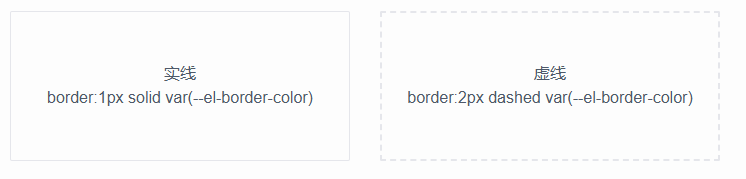

# Border 边框

边框是信息传达的主要载体，承担页面信息架构的分类作用，根据过往的产品设计经验，提供了各种场景下边框的使用建议。

##  线条

实线用于信息架构分类；虚线用于导入文件选择/证件照上传等场景

##  圆角

圆角是用一段与图形两边相切的圆弧替换原来的直角，圆角的大小用圆弧的半径R表示

在界面中运用圆角主要有以下两个好处：

</img>

- 亲和感。我们倾向于“避免尖锐的边缘，因为在自然界中它们可能会构成威胁”。运用圆角矩形能给我们带来亲和感，圆角越大，亲和感越高。

- 辨识度。相对于没有圆角，人可以更快的辨识圆角矩形。

- 小圆角 小的边界半径2px适用于小型组件，如复选框标记和标签、tag、按钮和输入组件等。

- 标准圆角: 中等大小的半径4px适用于卡片、Panel类的组件。

##  阴影
::: tip
现实生活中的物体不可完全重叠，当光打过来时，每个物体都会产生阴影。这是我们理解物体的层叠关系的重要依据。依据现实中的这一行为，我们把阴影规范挪到屏幕世界中，使得用户更容易理解我们的系统。阴影规范提供给了我们另一个表达元素区别的维度，不同的阴影清楚地传达了不同的交互状态。

:::

需要用到阴影的地方统一使用系规范提供标准阴影

## 间距

用来表示容器嵌套每一层的边距、间距，组件内部元素之间的间距等

- 大间距： 一般情况下，大间距用于模块一级容器的间距，容器和页面的间距

- 标准间距： 用于模块一级容器的内边距，二级容器的间距

- 小间距： 用于三级容器的内边距、间距，子容器内部布局的间距，组件内的间距等