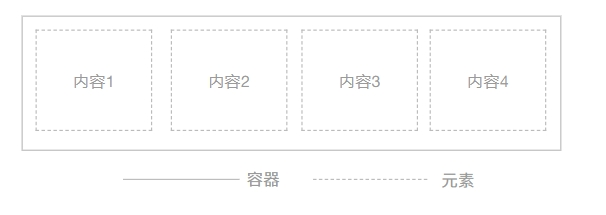
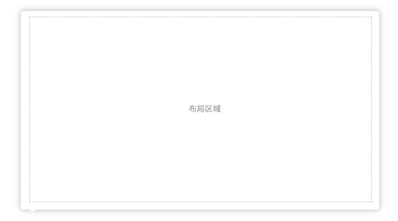

# 页面布局

## 概念

</img>

- web框架

系统框架提供的菜单、标题行等公共功能区域

- 页面

除了web框架剩余的区域都属于页面

弹出层也属于页面 `v1.1`

- 布局

根据功能不同，在页面中将不同的区域切割划分

- 块容器

布局中包裹块容器，块容器用来包裹具体元素的组件，块容器内部可以继续嵌套容器

- 元素

具体的原子组件，不能直接暴露在布局层，必须包裹在块容器中
## 普通页面
::: tip
web框架中直接嵌套的页面
:::

### 样式
- 背景色
普通页面背景色使用页面背景色(`--el-bg-color-page`)
弹窗和抽屉使用默认背景色(`--el-bg-color`)


</img>

- 无边距、边框、阴影


### 层级

- 页面

应该直接嵌套在web框架内部，为可绘制区域的根节点。


</img>

- 布局

页面和容器之间应该使用`flexbox`组件进行布局。


</img>

- 容器

布局层下级直接包裹容器。一个容器包裹一个元素


</img>

- 元素 `v1.1`

元素内一般是同一类功能，布局相对自由，可以根据产品需求绘制

</img>


### 开发指导

-  具体的元素不应该直接出现在布局层，需要使用容器包裹


## 弹出层

::: tip
在普通页面之上的弹出层，包括`Dialog` 弹窗、`Draw` 抽屉
:::

</img>

### 样式

- 尺寸 `v1.1`

1. 表单使用固定尺寸，宽度固定，高度由内容撑开

单列表单宽度： `450px`

两列表单宽度:  `720px`

2. 普通页面布局使用百分比，宽度固定，高度由内容撑开


普通弹窗-大宽度: `80%`

普通弹窗-中宽度: `50%`

普通弹窗-小宽度: `30%`

3. 普通弹窗-满屏, `fullscreen`属性设置为`true`

```vue preview="iframe-follow" file="./01/01.vue"

```


- title  标题栏：

使用默认的标题，关闭按钮，标题栏不能隐藏
- body 内容：

背景色： 组件内置默认背景色(`--el-bg-color`)

边距：  无

边框：  无

阴影：  组件内置阴影

- 工具栏：

弹窗底部工具按钮，可以隐藏该区域

不能出现多行
### 层级


- 页面

规定弹窗的宽度，可以是具体尺寸或百分比

高度由内容撑开

</img>

- 布局层

使用flexbox布局

弹性区域放具体的容器，或者继续使用flexbox嵌套布局

:::tip
工具栏不使用`Dialog`本身自带的`footer`区域，而是在body区域使用`flexbox`布局底部固定区域
:::

</img>

- 容器

布局下级包裹容器

工具栏使用`box`容器包裹，内部使用`flex-line`布局进行横向布局

</img>

### 开发指导

- 使用`flex-line`组件给工具栏分区
- 根据布局规范，在弹窗中依然使用`flexbox`布局，但是弹性区域会失效，弹框的高度会根据容器内组件的高度撑开；组件内容高度不确定时可以使用`flexbox`布局提供的高度和宽度的属性


## Popver 弹出层 `v1.1`

:::tip
弹出框中使用复杂的布局也当成是一个独立页面，布局方式与普通页面一样
:::

</img>


### 样式

- 内容：

背景色： 组件内置默认背景色(`--el-bg-color`)

边距：  无

边框：  无

阴影：  组件内置阴影
### 层级


- 页面

高度由内容撑开


- 布局层

使用flexbox布局

弹性区域放具体的容器，或者继续使用flexbox嵌套布局

- 容器

布局下级包裹容器


## 布局技术

- flex布局

`flexbox`  一个弹性盒子组件,分为固定区域和弹性区域

规范：

布局元素内容可以预计其宽度和高度时放在固定区域，固定区域的尺寸一般由内容撑开，也可以设置固定大小

一个页面中一般只有一个主要的信息块，放在最大的弹性区域中
</img>

- `grid`布局

24栏布局组件  ElementPlus   `Layout`

间隔：容器嵌套时按照容器布局规范，元素内布局时规定`gutter`间隔统一为6 `v1.1`

</img>

- `flex-line`  工具条布局组件

将工具条的内容分为左右两部分，左侧组件靠左，右侧组件靠右

规定`flex-line`只能放一行元素，不能出现多行

`flex-line`内部元素可以使用`el-space`留出间距

:::tip
`el-space`给一些组件之间留出间距，2个以上组件并排时使用`el-space`包裹
:::

</img>

- `filter-item` 元素布局

用于容器内部子元素需要显示label时使用

</img>


