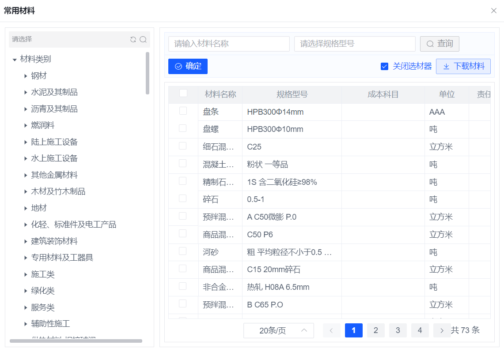
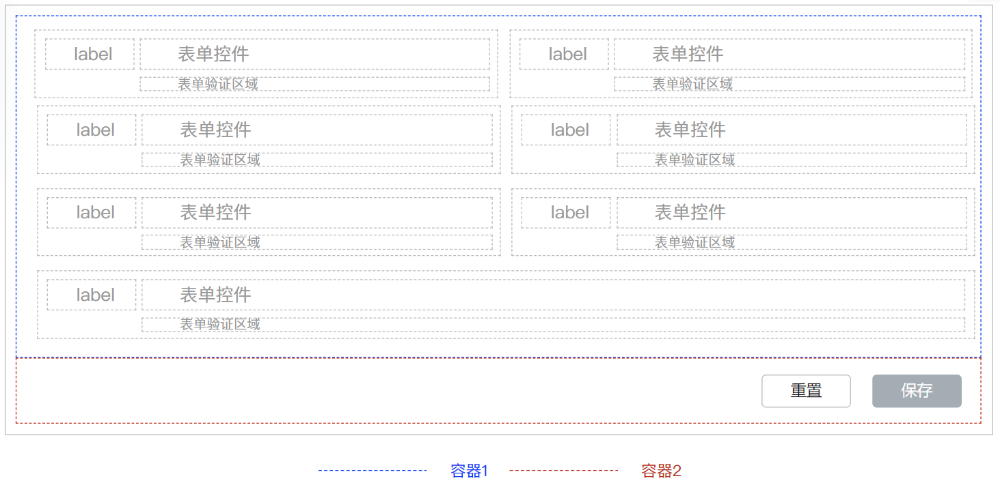
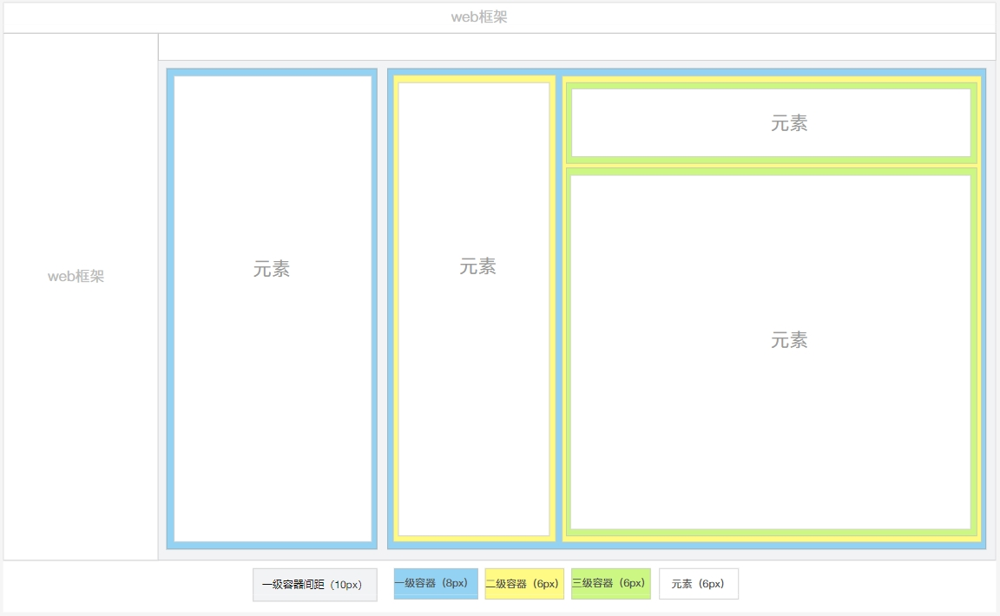

# 块容器布局


## 可用块容器

### Tab 选项卡

按业务需求进行分类

</img>

### Panel

一个基础的包裹容器，有标题和内容两个区域，标题可以隐藏

</img>

### Toolbar 工具条

分为过滤器区域和功能条区域，有可折叠功能

</img>


### 盒子

对元素进行包裹，不附带其他功能

</img>

## 样式

### 背景色

通常情况下使用容器组件默认背景色

或者根据容器组件提供的背景切换属性来切换背景色

无需特殊设置样式
### 边距
:::tip
内边距：容器内部留出的空间

间距：两个容器之间的空间
:::

#### 容器嵌套
- 一级容器

内边距`--el-layout-gap-base`  间距 `--el-layout-gap-large`

容器和页面间距为`--el-layout-gap-large`

- 二级容器

内边距`--el-layout-gap-small`  间距 `--el-layout-gap-base`

- 三级容器

内边距`--el-layout-gap-small`   间距 `--el-layout-gap-small`

#### 容器内包裹组件

- 内边距`--el-layout-gap-small`  间距 `--el-layout-gap-small`

- 每一级容器都可以直接包裹组件，直接包裹组件的边距按此规范执行


### 边框

原则：容器的父级元素（容器或页面）没有背景色的情况下，需要显示边框

#### 页面

- 一级容器 无边框

- 二级、三级容器需要显示边框

#### 弹出层 Dialog Draw Popver

- 一级容器有相邻容器（有多个一级容器），显示边框

</img>

- 一级容器无相邻容器（只有一个一级容器），不显示边框

- 二级、三级容器显示边框

- `Popver`内嵌布局时，由于`Popver`外层有一层默认的内边距，所以需要消除布局层最外侧边距 `v1.1`


### 容器合并

同一个功能中使用了多个容器时，可以合并容器，比如`Form`表单

容器合并时基本规范还是参照上文普通容器的规范，这里只描述特殊点

</img>

#### 边距 `v1.1`

- 布局层：删除相接两侧的边距

- 容器按：照层级规范显示内边距，相接的部分消除重复的内边距(消除一侧，另一侧内边距保留)

#### 边框

- 一级容器

页面： 不显示边框

弹出层： 多个一级容器显示边框，仅有一个一级容器不显示边框（容器合并算一个容器）`v1.1`

- 二级、三级容器：显示边框，消除相接部分两侧的边框

## 层级

- 一级容器应该都包裹在页面的的`flexbox`布局中。
- 二级、三级容器包裹在块容器的`flexbox`布局层中。
- 容器中可以直接包裹具体的元素组件；容器中也可以继续嵌套容器。
- 嵌套容器时需要使用`flexbox`绘制中间布局层（容器间的嵌套最多三层）。

</img>

## 容器元素关系

<table>
	<thead>
	<tr>
		<td>容器名称</td>
		<td>布局组件</td>
		<td>子级内容</td>
		<td>子集属性</td>
	</tr>
	</thead>

	<tbody>
	<tr>
		<td rowspan="2">Panel</td>
		<td>无布局层</td>
		<td>Table、List、Chart、BlockElement 等</td>
		<td>元素</td>
	</tr>
	<tr>
		<td>Flexbox</td>
		<td>Panel、TabPanel、Toolbar、Box</td>
		<td>容器</td>
	</tr>
	<tr>
		<td rowspan="2">TabPanel</td>
		<td>无布局层</td>
		<td>Table、List、Chart、BlockElement 等</td>
		<td>元素</td>
	</tr>
	<tr>
		<td>Flexbox</td>
		<td>Panel、TabPanel、Toolbar、Box</td>
		<td>容器</td>
	</tr>
	<tr>
		<td rowspan="2">Box</td>
		<td>无布局层</td>
		<td>Table、List、Chart、BlockElement 等</td>
		<td>元素</td>
	</tr>
	<tr>
		<td>Flexbox</td>
		<td>Panel、TabPanel、Toolbar、Box</td>
		<td>容器</td>
	</tr>
	<tr>
		<td>Toolbar</td>
		<td>FlexLine/Grid</td>
		<td>input、select、button等</td>
		<td>元素</td>
	</tr>
	</tbody>
</table>


## 规范
- 根据业务情景，或者界面划分来决定容器的嵌套，容器嵌套中子容器必须大于1个
- 容器嵌套的情况下，内部容器需要用边框、背景色其中一种进行区域划分，使人能一眼看出功能区域的不同

比如`toolbar`有默认的背景色，`panel`提供的边框、阴影等

- 组件必须使用容器包裹，不能直接裸露在布局层
- 容器嵌套不要超过三层，以免造成功能过于复杂，难以理解的问题。
- 如果其中一个一级容器中直接包裹的组件，那么其他一级容器最好也直接包裹组件，否则就会出现同一级容器内边距不相同的问题


- 如果`toolbar`作为一个一级容器，则显示`toolbar`组件内置的内边距

</img>

- 导航条作为一个特殊容器，放在页面顶部，无需留出间距

## 开发指导

- 容器组件的边框和阴影可以通过属性来控制显示或隐藏，无需自己写样式

- tabPanel需要自己手动给`el-tab-pane`class赋值`padding-base` `padding-small` `padding-large`来留出内边距`v1.1`

```vue preview="iframe-follow" file="./02/01.vue"

```