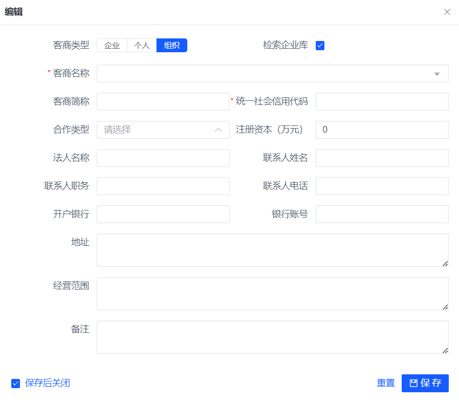
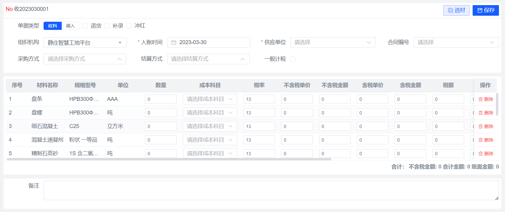
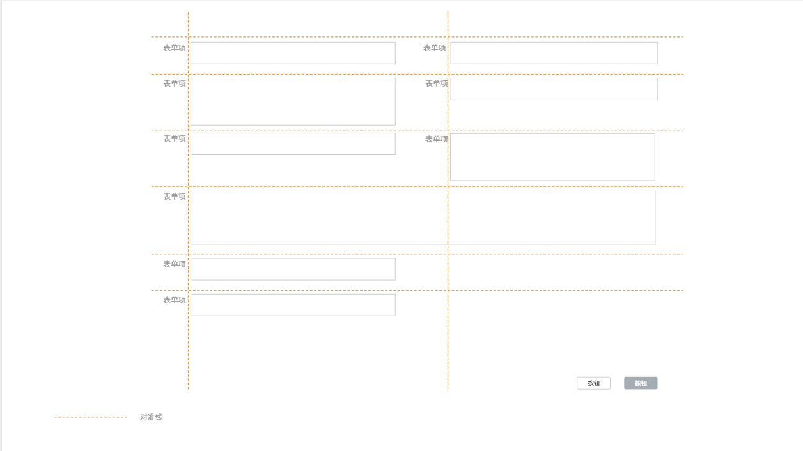
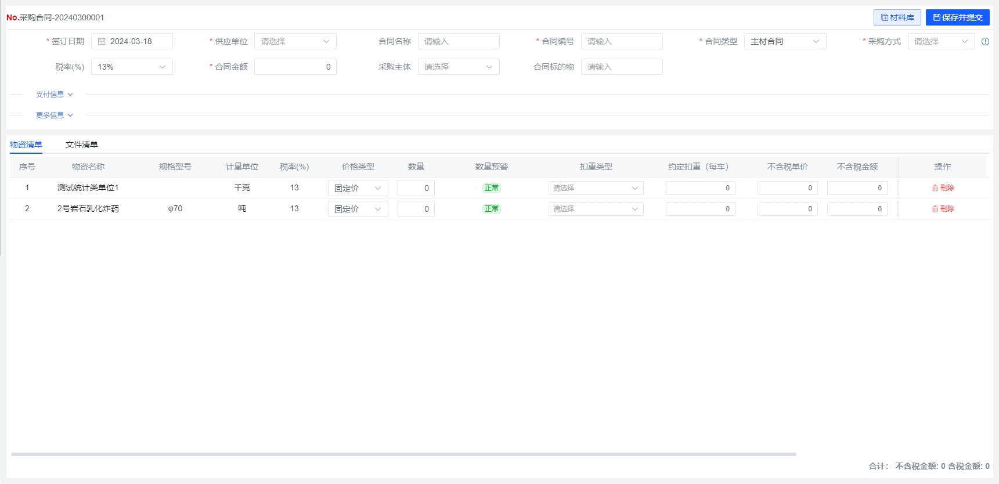
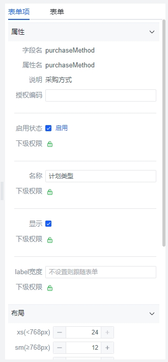

# 表单
## 使用场景
### 弹窗表单

单表编辑，并且表单项不超过20个使用

</img>

#### 布局

- 容器布局参照块`容器布局-容器合并`

- 弹窗表单分为内容区域和功能区域。内容区域：放置表单内容；功能区域：放置保存、取消、重置等功能按钮

- 内容区域

使用`box`包裹`el-form`组件

使用grid布局，弹窗表单不超过两列，10个以内的表单项使用单列,10-20个表单项使用两列

- 功能区域使用`box`包裹`flex-line`

- 表单弹窗宽度，一列宽度为`450px`，两列宽度为`720px`

- 不同类的表单信息可以使用分割线分割

#### 开发指导
- 弹窗表单使用`dialog`或者`drawer`作为载体
- 带有表单的弹框点击遮罩层不能自动关闭，防止有未保存的信息
- 表单统一使用弹框的拖拽功能
- 表单弹窗高度根据内容而定，尽量不要超过视口弹窗高度，弹框中不考虑使用`TabPanel`，如果输入项过多，使用页面表单；
- 如果弹窗组件有弹出弹窗的操作，请尽量将此表单改为页面表单（避免弹窗嵌套）
### 页面表单

#### 单表编辑表单项超过20个使用

- 在页面表单内容是分布表单和单表编辑时，可以在页面底部放置一个单行toolbar作为一级容器，放置功能按钮

- 表单项需要分组时使用分割线`fold-divider` `v1.1`

</img>

#### 主从表同时编辑时使用

- 操作功能放在第一个`panel`的工具栏中

</img>

#### 布局

- 使用`flexbox`布局，页面顶部有导航条，布局包裹容器（`panel`或`box`），容器内放表单组件，详细布局方式参照`页面布局`

#### 开发指导

- 功能按钮和单据编号放在第一个`panel`的头部
- 表单布局应该考虑响应式布局,响应式布局时需要可参照一下代码实现`:xs="24" :sm="12" :md="8" :lg="6" :xl="4"`。

### 页面表单-多项单表表单 `v1.2`
适用场景：数据结构为单表，并且表单项数量较多，内容复杂时使用。一屏展示不下时会显示滚动条。

</img>

#### 布局
- 位置：表单在容器中居中显示
- 宽度：为父容器的`60%`
- 表单项：使用Grid24栏布局，每一行占24栏

#### 开发指导

- 每一行只放一个或多个表单项，可以使用grid响应式布局
- 可以使用分割线将表单进行区域划分
- label靠右，内容靠左
- 保存按钮可以放在容器右上角，也可以放在表单最下方，保存按钮靠右显示

### 页面表单(tabPanel) `v1.1`

#### 复杂表单，表单项过多，并且不同的类型需要分组录入时，使用tab表单

布局方式使用页面和容器布局规范

</img>

### 折叠面板表单 `v1.1`

- 折叠面板作为一个普通元素来使用，外部需要包裹容器

- 表单项需要包含`label`和表单项组件，一般使用`filter-item`或`el-form-item`组件

</img>

### 表单类型

#### 主从表多行编辑

有多行编辑统一使用页面表单

使用`TableEdit`组件，主从表一起保存

#### 单表多行编辑
使用`TableEdit`组件一次性添加多行数据进行保存，修改时单条修改
#### 表格编辑

- 在表格中直接渲染组件，进行编辑

- 数据实时保存

#### 分布表单

在有需要将表单划分成不同步骤时使用，可以已弹窗或页面为表单载体

- 在页面表单内容是分布表单和单表编辑时，可以在页面底部放置一个单行toolbar作为一级容器，放置功能按钮

- 在弹窗表单中使用时参考弹窗表单的布局规范，表单放在内容区，功能放在底部功区

## 开发指导

### 表单

- 表单组件有`el-form`，`table-edit`，`filter-item` 在使用时需要在表单组件外部包裹容器(`panel`、`box`)，不能直接裸露在布局层 `v1.1`

### 表单项

- 不管是一列还是多列表单，表单项都要对齐，在表单项过长时可以合并列
- 功能按钮不与表单项混用，如果需要混用，使用`small`大小的按钮
- 表单中控件应该显示控件label，并且label不能出现换行,label文字靠右
- 表单中应该适当的使用`alert`元素进行操作提示
- 表单组件应该标记必填项、根据业务需求使用进行表单验证
- 表单组件不能单独出现在布局中，应该都使用`box`包裹
- 多个表单组件可以进行合并在同一个表单项中，合并使用`el-space`包裹
- `行内表单`和`折叠面板表单`表单组件大小使用`small` `v1.1`

### 表单项组件

-  `CheckBox`用肯定语句命名；一般情况下，表单中的布尔类型的字段或多选都使用`CheckBox`
-  单选框使用`Radio`,选项数量一般为2-5个之间，当选项数量特别多时，建议使用选择器或下拉菜单展示。
- `radio-button`大小统一使用`default` `v1.1`
-  需要立即生效的操作使用Switch ,`Switch`统一使用`small` `v1.1`
-  占位符：`Select`或`Input`需要给占位文本提示，语言描述简洁明确
- 文本框：使用input组件，行数为2（ `type=textarea  rows="2"`） `v1.1`

