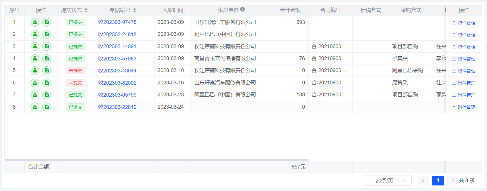
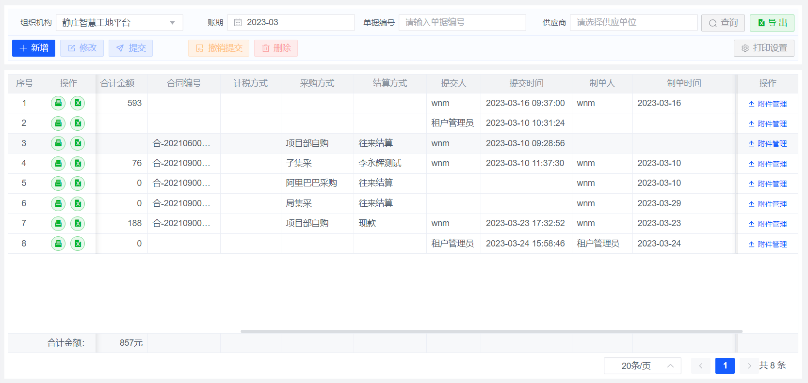
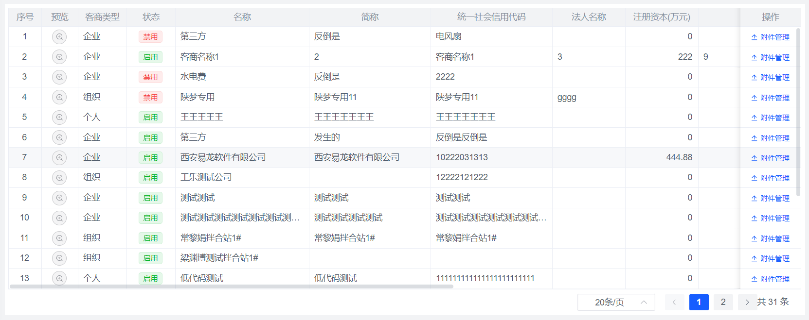
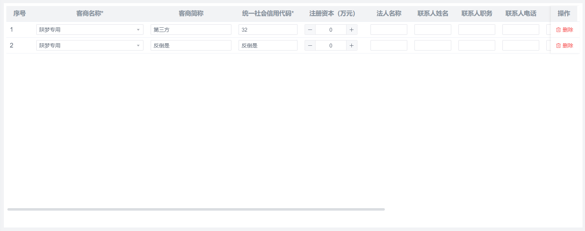
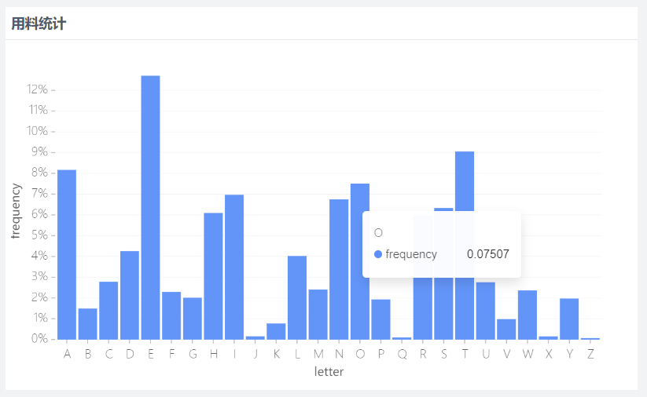
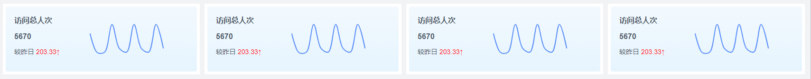
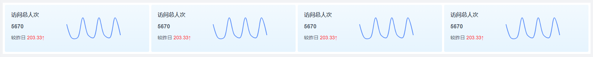

# 数据展示

## Table 表格
### 表格分类
#### 不分页

没有分页功能条，只有一页数据

汇总报表已经将所有数据查询出来的无需分页

</img>

#### 后分页

后端查出所有结果，在前端分页

汇总报表已经将所有数据查询出来数据较大时在前端使用后分页

#### 先分页

在后端分页，每次只返回当前页的数据

一般的数据录入模块，明细查询可以使用先分页表格

</img>

#### 翻页表格

在后端分页，每次只能查询上一页或下一页数据，不能跳页


</img>

### 开发指导
#### 表头

</img>

- 表头统一居中，表头标题尽量不换行
- 根据内容设置列宽，尽量显示完整，留一列较长列作为自适应列，表格铺满；如果列太多，超过屏幕宽度，则不用使用自适应列，每列给宽度即可；如果列太少（少于5列），可以不用设置自适应列，固定列宽`v1.1`
- 表头除了标题，可以摆放排序按钮、info信息提示图标按钮，其余表头信息暂不支持摆放

#### 冻结
</img>

- 列冻结-前冻结  一些重要的信息字段可以在表格前面冻结
- 列冻结-后冻结  一些功能按钮，比如附件管理、删除等
- 行冻结  合计行在表格下方冻结行

#### 排列方式

</img>

- tag：1个tag的情况下居中，多个tag则靠左
- 序号、选择器、操作按钮 居中
- 表格内容文字靠左，数字靠右
#### 按钮
##### 按钮形状
- 使用文字按钮，按钮大小`small`

普通按钮都使用文字按钮，带图标


```vue preview="iframe-follow" file="./05/01.vue"

```


- 图标按钮，按钮大小`small`,`plain`空心

纯图标按钮是在一些特定功能下使用

使用纯图标按钮应该使用`tooltip`给出按钮提示，`tooltip`统一使用黑色主题，方向为`top`

比如：打印、导出、预览

图标大小默认`14px`


```vue preview="iframe-follow" file="./05/02.vue"


```

- 单据预览，除了使用图标按钮，也可以将单号显示为文字按钮，按钮大小为`默认`，颜色为`主色`，点击单号跳转预览页面


```vue preview="iframe-follow" file="./05/03.vue"

```

##### 按钮类型

- 操作功能按钮

色彩：主色

形状：文字带图标

尺寸：小

示例：
```vue preview="iframe-follow" file="./05/04.vue"

```

- 辅助按钮

色彩：成功色

形状：圆形图标按钮

尺寸：小

示例：
```vue preview="iframe-follow" file="./05/05.vue"


```
- 普通按钮

色彩：信息色

形状：圆形图标按钮

尺寸：小

示例：
```vue preview="iframe-follow" file="./05/06.vue"

```

- 危险按钮

色彩：危险色

形状：文字带图标

尺寸：小

示例：
```vue preview="iframe-follow" file="./05/07.vue"

```
- 警告按钮

色彩：警告色

形状：文字带图标

尺寸：小

示例：
```vue preview="iframe-follow" file="./05/08.vue"

```
- 特殊情况  单据链接

色彩：主色

形状：链接

尺寸：默认

示例：
```vue preview="iframe-follow" file="./05/09.vue"

```
#### tag的使用
tag可以代表这一行数据的某种状态

- 表格内`tag`尺寸使用`small`

- tag的颜色有主色、成功色、警告色、危险色、信息色，所以tag的含义也是具有指向性的。如果只是为了区分数据的类型，没有指向性，则使用文本渲染，或者使用信息色、主色的tag

主色、信息色：没有指向性，相当于给该行数据打上某种标签 <el-tag size="small" type="primary">主要信息</el-tag>  <el-tag type="info" size="small">普通信息</el-tag>

成功色：代表数据可以使用，是安全的 <el-tag type="success" size="small">成功</el-tag>

警告色： 是一种警告，代表该状态有一定的影响，提示用户知晓即可 <el-tag type="warning" size="small">警告</el-tag>

危险色： 代表数据不可用，是不安全的 <el-tag type="danger" size="small">危险</el-tag>


例如：

```vue preview="iframe-follow" file="./05/10.vue"

```
    启用状态，已启用代表数据可以使用，是安全的，用成功色表示；禁用代表数据不可用，是不安全的，则用危险色表示

    提交状态，已提交代表数据可以使用，是安全的，用成功色表示；未提交代表数据不可用，还有可能被修改，是不安全的，则用危险色表示


- 一个表格中tag列不要超过三列，否则会造成页面状态混乱，很难直接的看到重要信息

- 一个状态tag内容不应该使用`是` `否`来表示，应该起一个有具体含义的名称

错误示范：表头`是否启用` ，内容： <el-tag type="success" size="small">是</el-tag> <el-tag type="danger" size="small">否</el-tag>

正确示范：表头`状态` ，内容： <el-tag type="success" size="small">启用</el-tag> <el-tag type="danger" size="small">禁用</el-tag>

#### 排序

- 每个表格查询的时候都要有默认排序，排序时都要使用id排序，防止顺序混乱

- 可以在表头增加用户自定义排序功能，后端要做支持


#### 其他
- 表格的行高固定，如果内容的字数过长，显示气泡提示框（组件内部已处理）
- 数字补零： 金额补零，数量、单价不补零

</img>

- 表格默认不带斑马线

- 表格中的表单组件都使用`small`大小，比如：Input、Select等

</img>

#### 排序

## list 列表

列表是一个多行数据展示器，不同于表格，`list`是每一行数据都可以绘制不同的样式，不局限于形式。

分页`list`自带分页功能，可以像分页表格一样实现分页功能

### 列表分类
#### 不分页

没有分页功能条，只有一页数据

汇总报表已经将所有数据查询出来的无需分页

#### 后分页

后端查出所有结果，在前端分页

汇总报表已经将所有数据查询出来数据较大时在前端使用后分页

#### 先分页

在后端分页，每次只返回当前页的数据

一般的数据录入模块，明细查询可以使用先分页表格

</img>

#### 翻页表格

在后端分页，每次只能查询上一页或下一页数据，不能跳页


</img>

## 信息面板

应用于单据信息展示，可以放在弹框或页面中

</img>

### 排版布局

- 布局： `Grid`布局，响应式参照`:xs="24" :sm="12" :md="8" :lg="6" :xl="4"`

- 包裹`FilterItem`组件，设置`description`为`true`

- `label`区域不换行

- 信息量较大时使用折叠功能`fold-divider`  `v1.1`
</img>

### 字段名

- label右对齐
### 字段值

- 字段值左对齐

- 字段值可以使用tag渲染，tag的使用规范参考上文表格中的`tag的使用`

- 字段值过长使用`LabelExtend`组件，超长会显示tooltip

## chart 图表

一些指标项可以使用图表很直观的展示

</img>

### 排版布局

- 使用容器包裹

- 容器内部留有至少`6px`的内边距，不能直接挨着容器， 也不能留白太大

- 图表一般不能设置自适应大小，只能固定大小，这个时候给宽高时要根据实际情况，给出合适的宽高尺寸

- 图标在容器中居中显示，不能偏移

### 开发规范

- 图表要显示标题，如果是图表组，则在公共区域显示标题

- 一般情况下需要显示图例，如果是多个图表组合，可以在公共区域给出图例说明

- 柱状图、折线图、散点图需要显示坐标，饼图鼠标划过显示统计块的说明

- 颜色一般使用色彩中提供的主题色、辅助色。如果产品需求需要换颜色，则按照产品给出的色值重置图表


## statistics 统计块

统计数字分为两种，一种是正常统计块，放在页面排版布局中；一种是统计数字，放在`toolbar`的功能条中
### 排版布局

- 布局方式一  容器布局

使用`grid`布局，将页面按照统计块的数量均分

统计块包裹在各自的容器中，容器之间留有间隔，间隔`gutter`按照`布局容器规范`来给

一级容器间隔为10，二级容器间隔为8，三级容器间隔为6

</img>


- 布局方式二  容器内布局

使用一个大的容器包裹，直接放在大的容器中

多个统计块相当于一整个组件，组件内部再使用`grid`布局，`gutter`设置`6px`，具体的形式可以按照产品设计原型实现

</img>


### 场景

- 较多的数据统计指标使用统计块

</img>

- 较少的数据统计可以使用统计数字，放在toolbar的功能 `v1.1`

</img>
